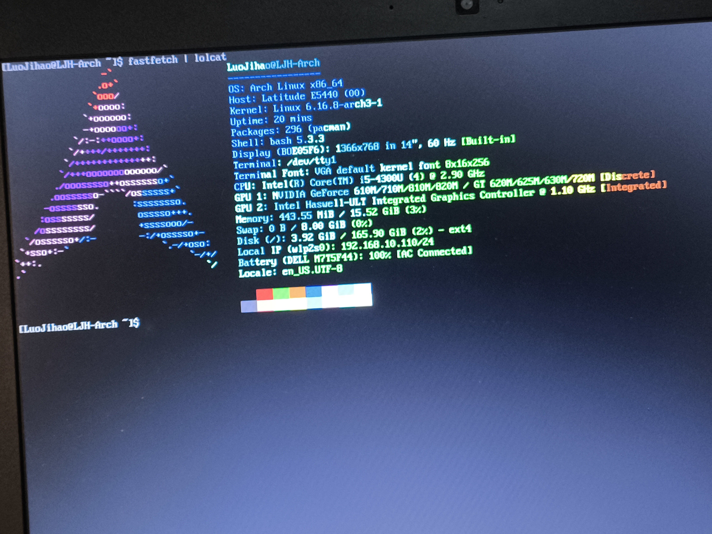
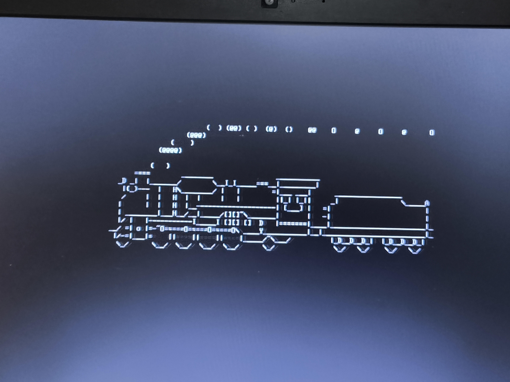
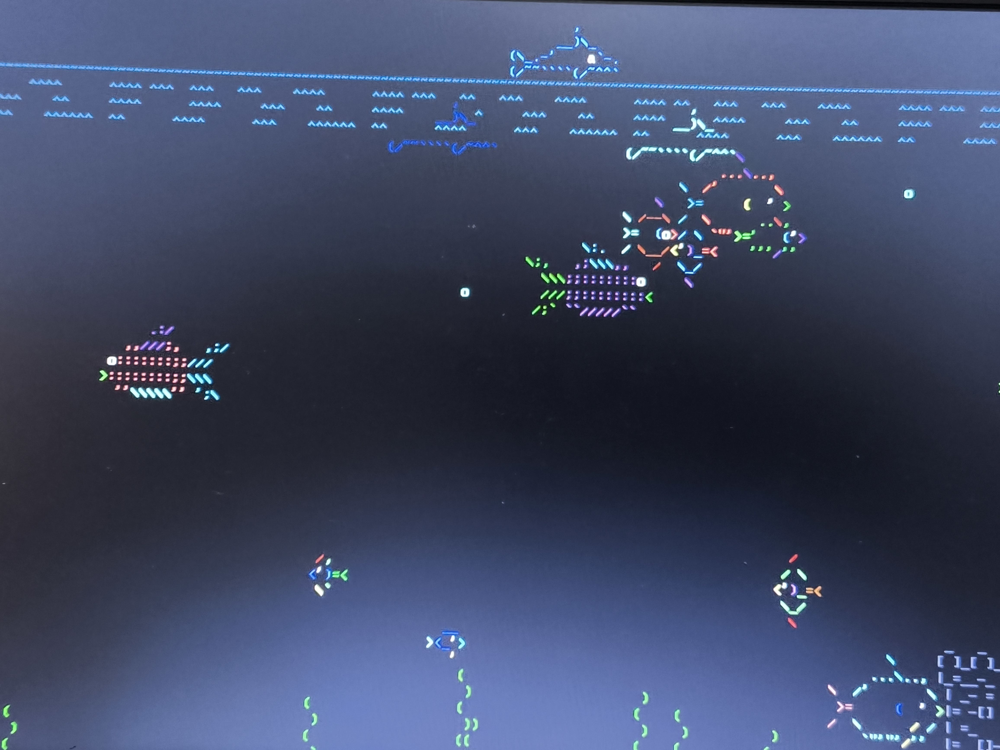
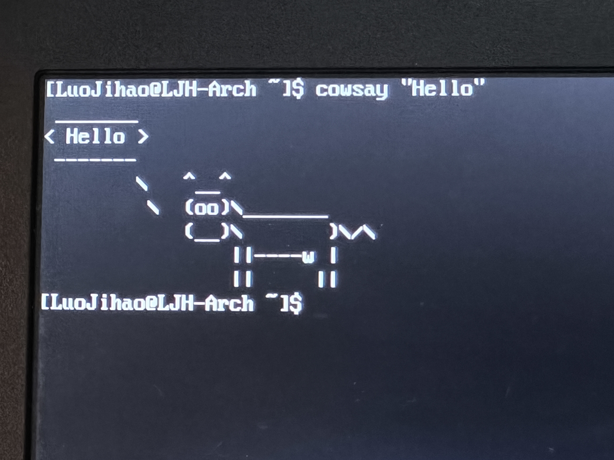
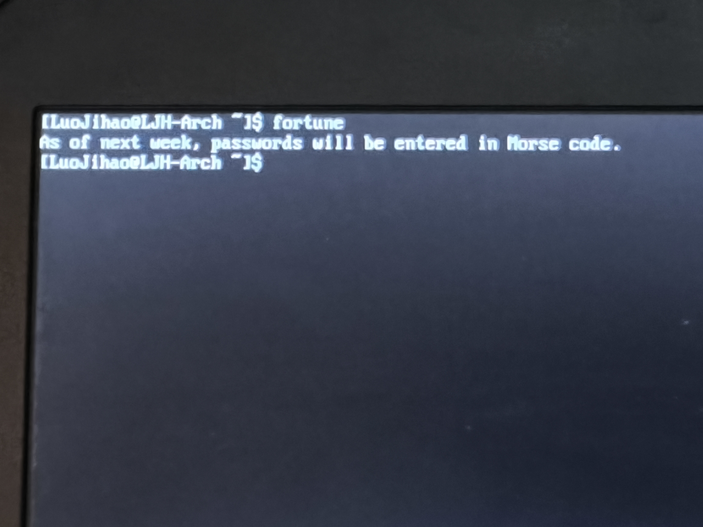
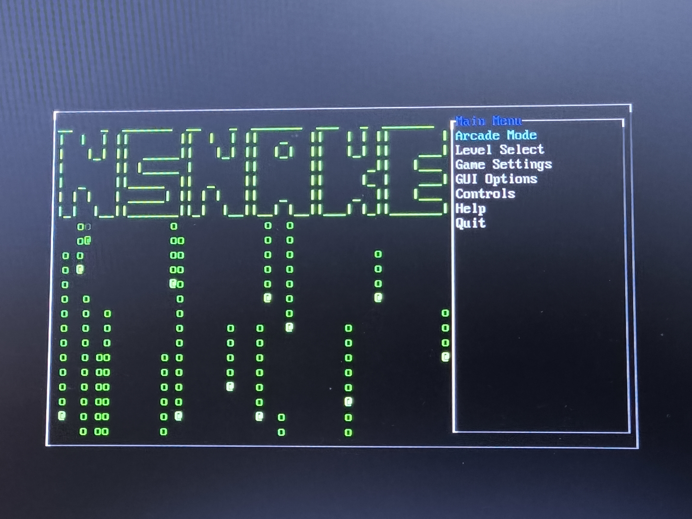
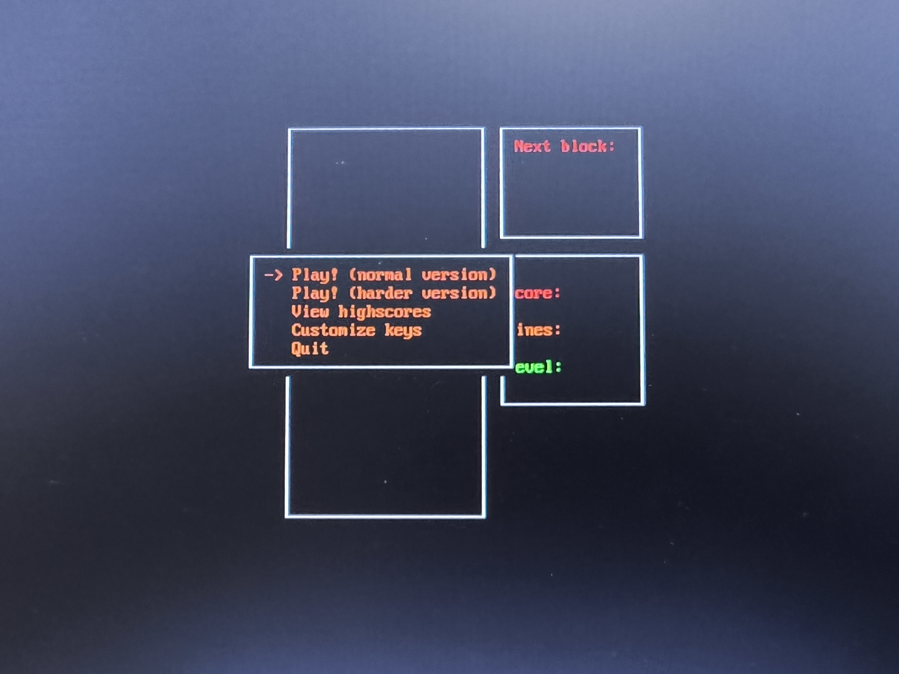
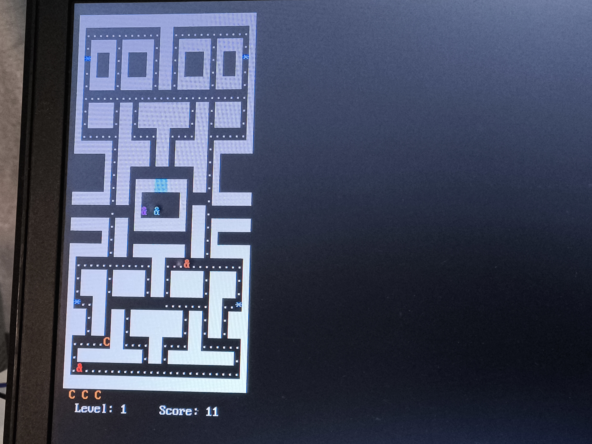

# TTY 里“隐藏”的乐趣

## 前言

在上一篇我们已经完成了 **Arch Linux** 的手动安装，但面对黑乎乎的 **TTY** 环境多少都会有一些不知所措 😶，不用慌张，这篇就会给你带来一些 **好玩** 的东西 🥳，让你的 **TTY** 环境不那么单调 🌈。

我的 **Arch Linux** 装在我家的旧笔记本上，为了方便就采用了直接拍屏的方法，还请见谅。

## fastfetch | lolcat

  

用 `sudo pacman -S fastfetch lolcat` 即可完成安装。

`fastfetch` 是一个用来在终端(命令行界面)中漂亮地显示系统信息的工具。当你在终端输入时，它会立刻展示一个由 **ASCII** 字符组成的你的 **Linux** 发行版 **Logo**，旁边配上你电脑的各种软硬件信息，看起来非常酷😎。

`lolcat` 是可以把终端输出变成 **彩色** 🌈。

`|` 在 **bash** 中的作用不等于平常的C/C++里面的 **或** 的意思，它的作用可以简单理解为把左边的输出作为右边的输入，在这里就是把 `fastfetch` 的输出当作 `lolcat` 的输入。

所以这条指令可以输出 **彩色** 的带有 **Logo** 和你电脑各种信息的 **“彩虹系统摘要”** 。

## cmatrix

  

用 `sudo pacman -S cmatrix` 即可完成安装。

`cmatrix` 的作用就是代码雨，当然也可以配合 `lolcat` 一起使用，那就是彩色的代码雨。

## sl

  

用 `sudo pacman -S sl` 即可完成安装。

`sl` 是当你不小心把 `ls` 输错成 `sl` 时，一辆蒸汽小火车会从你的屏幕上呼啸而过。专门用来“惩罚”打错字的用户。

## asciiquarium

  

用 `sudo pacman -S asciiquarium` 即可完成安装。

`asciiquarium` 是一个用 **ASCII** 字符画出来的水族馆，有各种鱼和水草在你的终端里游动。

## aafire

  

用 `sudo pacman -S aalib` 即可完成安装，其中 `aafire` 是 `aalib` 的一部分。

`aafire` 可以在你的终端里燃起一团熊熊的 **ASCII** 火焰。

## cowsay “Hello”

  

用 `sudo pacman -S cowsay` 即可完成安装。

`cowsay` 可以把后面双引号中的东西进行输出。

## fortune

  

用 `sudo pacman -S fortune-mod` 即可完成安装。

`fortune` 会随机显示一句名人名言、笑话或者有趣的短语。如果和 `cowsay` 和 `lolcat` 一起使用会有奇效 🤓。

## btop

  

用 `sudo pacman -S btop` 即可完成安装。

`btop` 是一个现代化、界面酷炫、信息极其丰富的系统资源监视器，我本人很喜欢 🤗。

## nsnake

  

用 `sudo pacman -S nsnake` 即可完成安装。

`nsnake` 是个经典的贪吃蛇游戏。

## bastet

  

用 `yay -S bastet` 即可完成安装。

`bastet` 是个经典的俄罗斯方块游戏。

## pacman4console

  

用 `yay -S pacman4console` 即可完成安装。

`pacman4console` 是一个制作精良的 **ASCII** 版吃豆人游戏(好像还有音效，但我可能没装相关包所以没听到)。

## 结语

这些就是我这几天看到的有趣的“小玩意儿”，至于一些好用的功能的 **包** 我会放在 **reference** 里面，一些打算写的还没来的及的也会在 **RREADME** 里面留下痕迹。

那么，我们下次再见！！！